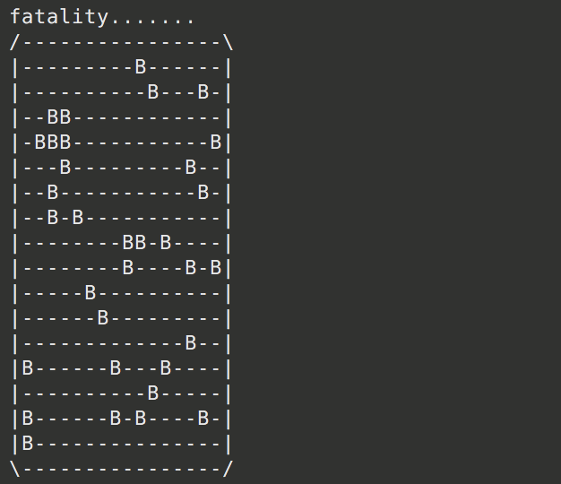

# MineSweeper
Simple minesweeper implementation that only allows selecting a single block at a time using cin to take x and y coordinates.

Example Screenshots:
 

This served as an exercise to practice using 2d vectors in C++.

